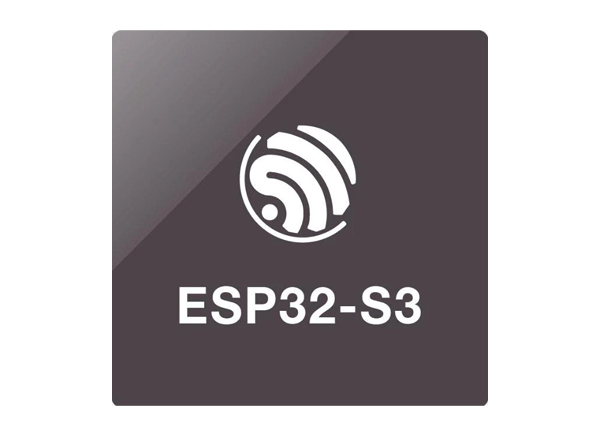
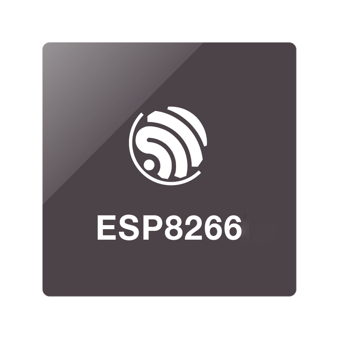
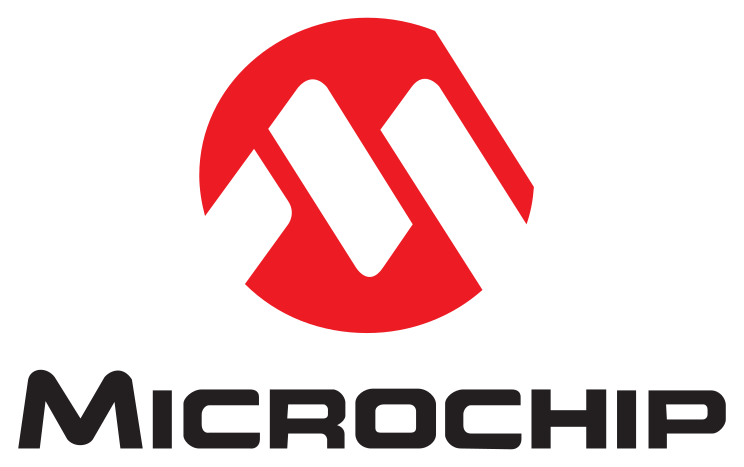

<h1>Hi 👋, I'm Ahmed Khaled (@Ahmed1893)</h1>

Welcome to my profile! I’m passionate about embedded systems, IoT, and full-stack development.

🔧 **Embedded Systems Developer | IoT Enthusiast | Full-Stack & Open Source Contributor**

I'm passionate about learning new technologies and continuously expanding my skill set. From embedded systems and IoT to full-stack web development, I enjoy building practical solutions and sharing knowledge.

---

<h2>🚀 Languages and Tools I Use</h2>
<dev style="display: flex; flex-direction: row">
  
</dev>
<dev style="display: flex; flex-direction: row">
  
</dev>

---

<h2>🌱 About Me</h2>
<ul>
  <li>Interested in learning new stuff and exploring different technologies.</li>
  <li>Studied C and C++, became an embedded software developer using PIC (Microchip) and STM32F103C8T6 (STM Electronics) and a PCB Designer.</li>
  <li>Working in the IoT field with ESP32 and ESP8266 (NodeMCU).</li>
  <li>Studied Full-Stack Development: HTML, CSS, JavaScript (Front-End) and Flask, Python (Back-End).</li>
  <li>Currently using Linux (Ubuntu) and enjoying more flexibility than Windows.</li>
  <li>Always interested in learning new technologies and exploring innovative projects.</li>
  <li>📫 Reach me via email: <a href="mailto:ahmed18595@gmail.com">ahmed18595@gmail.com</a></li>
</ul>

---

## 📂 Notable Projects

### Heat Equation GUI

  

Python GUI for solving 1-D heat equation with interactive sliders and visualization.

---

### Code Runner Execution Time Show

  

Track and visualize code execution time for C/C++ projects.

---

### Heart Disease Prediction

  

Machine learning project to predict heart disease from patient data.

---

### Fabric Defect Detection YOLOv8 Raspberry Pi 4

  

Detect fabric defects using YOLOv8 on Raspberry Pi 4 in real-time.

---

<h2>⚡️ Where to Find Me</h2>

  

---

<h2>📊 GitHub Stats</h2>

  

  

  

<h2>🏆 GitHub Trophy</h2>

  

<h2>✨ Fun Animated Badges</h2>

  
  
  
  

